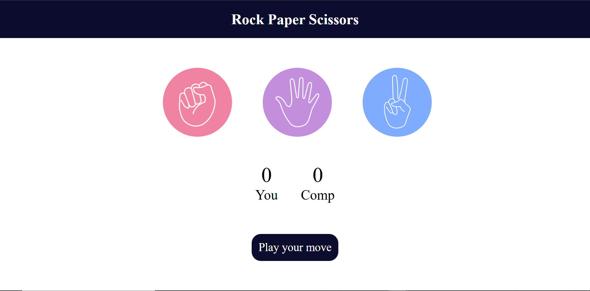

# 🎮 Rock Paper Scissors Game

A simple and interactive **Rock Paper Scissors** game built using **HTML**, **CSS**, and **JavaScript**. The game allows users to play against the computer with real-time score updates and random computer choices.

---

## 🚀 Live Demo

🔗 https://devsparkcodes.github.io/rock-paper-scissors-game/

---

## 📖 Project Overview

This project was created to practice JavaScript fundamentals, DOM manipulation, event handling, and basic game logic while building an interactive web application.

---

## ✨ Features

- 🎮 Play Rock, Paper, Scissors against the computer
- 🤖 Random computer move generation
- 📊 Live score tracking
- ⚡ Instant game results

---

## 🛠️ Tech Stack

- HTML5
- CSS3
- JavaScript (ES6)

---

## 📂 Project Structure

```
rock-paper-scissors-game/
│── assets/
│── images/
│── index.html
│── style.css
│── script.js
└── README.md
```

---

## 💻 Installation

1. Clone the repository

```bash
git clone https://github.com/devsparkcodes/rock-paper-scissors-game.git
```

2. Navigate to the project folder

```bash
cd rock-paper-scissors-game
```

3. Open `index.html` in your browser.

---

## 📸 Screenshot



---

## 🎯 Learning Outcomes

Through this project, I practiced:

- JavaScript fundamentals
- DOM manipulation
- Event handling
- Conditional statements
- Functions
- Random number generation
- Basic game logic

---

## 🔮 Future Improvements

- Add animations
- Add sound effects
- Add difficulty levels
- Store scores using Local Storage
- Improve UI/UX

---

## 👨‍💻 Author

**Muhammad Umar**

- GitHub: https://github.com/devsparkcodes
- LinkedIn: https://linkedin.com/in/devsparkcodes

---

⭐ If you found this project helpful, consider giving it a star.
