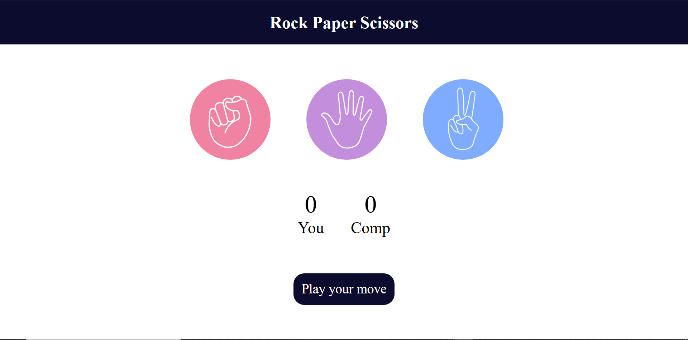

# Rock Paper Scissors Game

A browser-based Rock Paper Scissors game built with HTML, CSS, and JavaScript. The project allows users to play against the computer with random computer choices and real-time score updates.

---

## Live Demo

[Play the Game](https://devsparkcodes.github.io/rock-paper-scissors-game/)

---

## Project Overview

This project was built to practice JavaScript fundamentals while creating an interactive web application.

It focuses on DOM manipulation, event handling, functions, conditional logic, random number generation, and implementing basic game logic.

---

## Features

- Play Rock Paper Scissors against the computer
- Generate random computer choices
- Track the score in real time
- Display the result of each round instantly
- Interactive browser-based gameplay

---

## How It Works

The player selects one of three choices:

```text
Rock
Paper
Scissors
```

The computer generates a random choice. JavaScript then compares the player's choice with the computer's choice and determines the result of the round.

The score is updated after each round.

---

## Tech Stack

| Technology | Purpose |
|---|---|
| HTML5 | Structure and game interface |
| CSS3 | Styling and layout |
| JavaScript (ES6) | Game logic and interactivity |

---

## Project Structure

```text
rock-paper-scissors-game/
│
├── assets/
├── images/
├── index.html
├── style.css
├── script.js
└── README.md
```

---

## Getting Started

### Clone the Repository

```bash
git clone https://github.com/devsparkcodes/rock-paper-scissors-game.git
```

### Navigate to the Project

```bash
cd rock-paper-scissors-game
```

### Run the Project

No dependencies are required.

Open `index.html` in a web browser, or run the project using a local development server such as VS Code Live Server.

---

## Screenshot



---

## Learning Outcomes

Through this project, I practiced:

- JavaScript fundamentals
- DOM manipulation
- Event handling
- Conditional statements
- Functions
- Random number generation
- Basic game logic
- Dynamic UI updates

---

## Future Improvements

- Add animations
- Add sound effects
- Add difficulty levels
- Store scores using Local Storage
- Further improve the UI and user experience

---

## Author

**Muhammad Umar**

Building practical applications at the intersection of software engineering and AI.

- GitHub: https://github.com/devsparkcodes
- LinkedIn: https://linkedin.com/in/devsparkcodes
